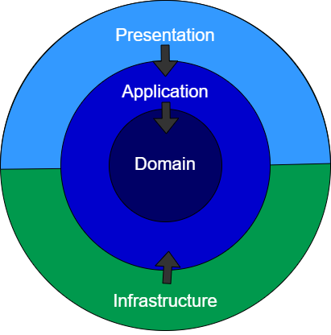

# breakpoint.testapp
Git branching intro

Clean architecture

Domain layer at the core, followed by Application layer then Presentation layer 
and Infrastructure layer.

Domain layer contains the entities or types that can be use in the application and it 
does not have any dependency.

Application layer contains business logic and depends on domain layer.

Both infrastructure and Presentation depends only in Application layer. Infrastructure 
contains external concerns like the type of database while Presentation layer is 
responsible for presenting the data to the client application for example in this 
project it will be the react js application.

